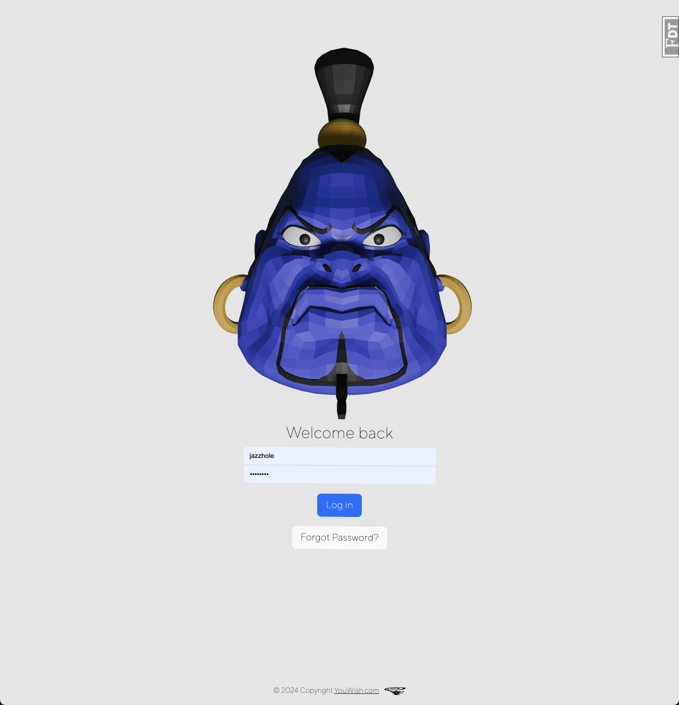
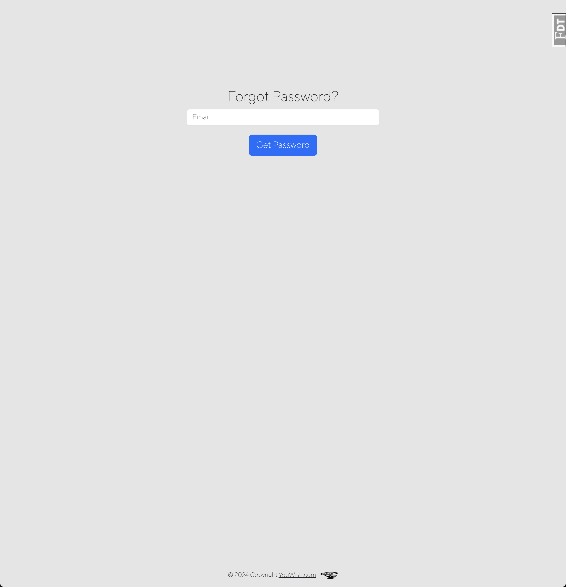
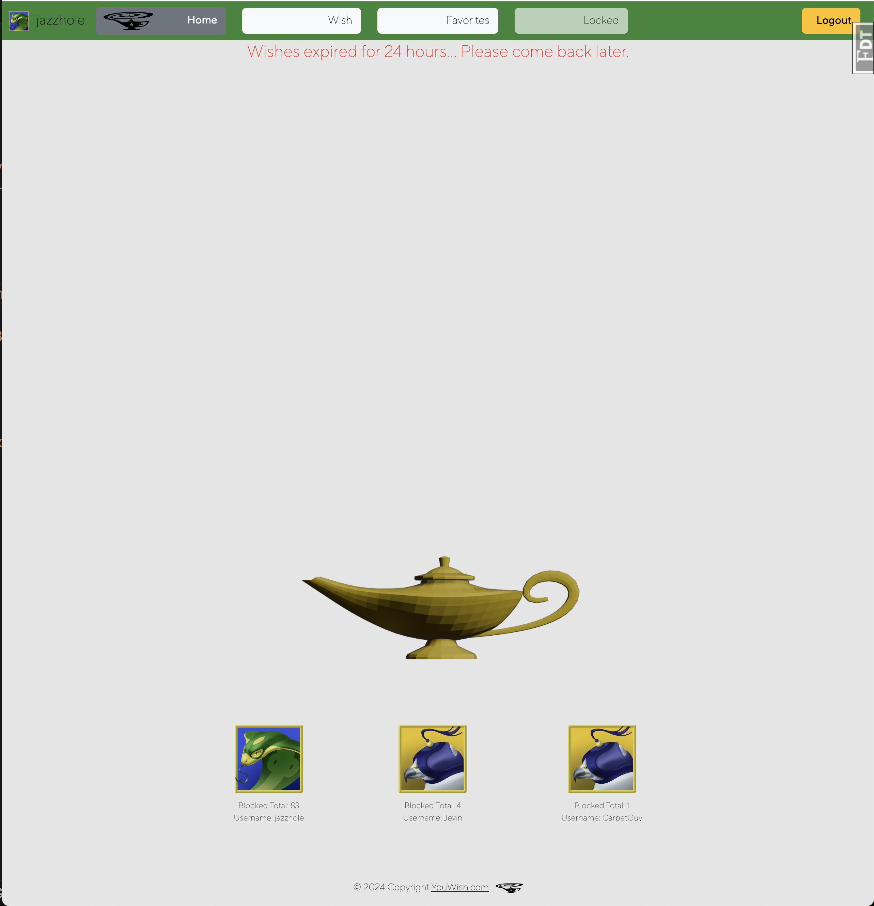
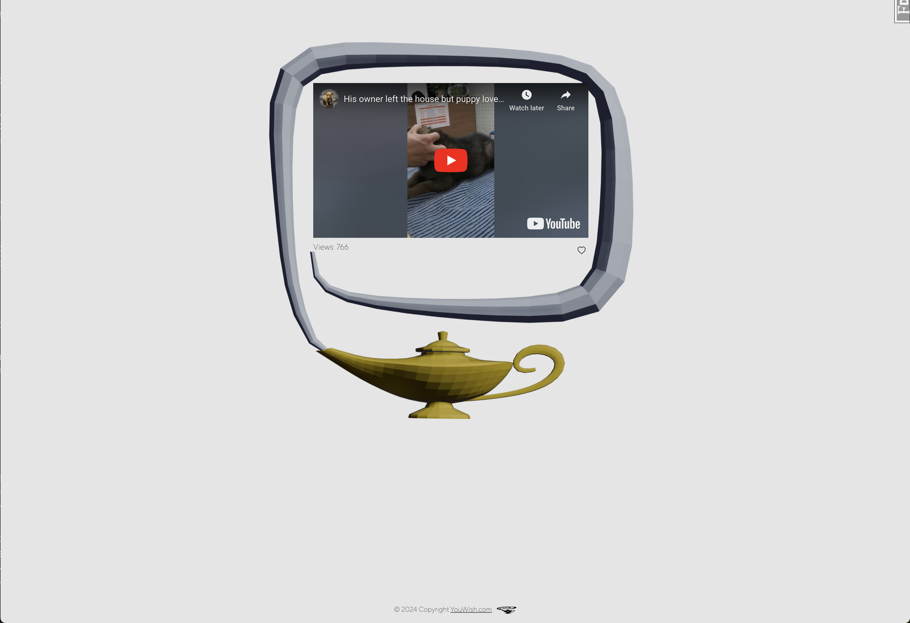
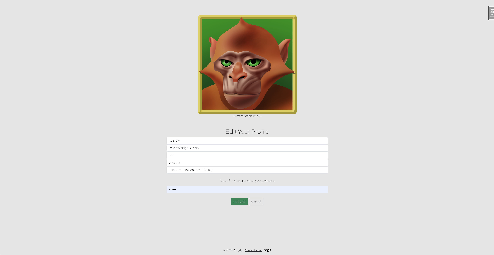
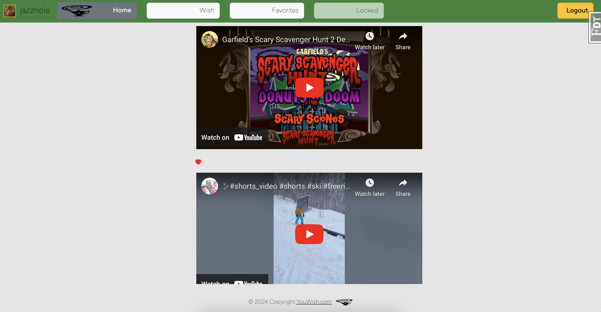
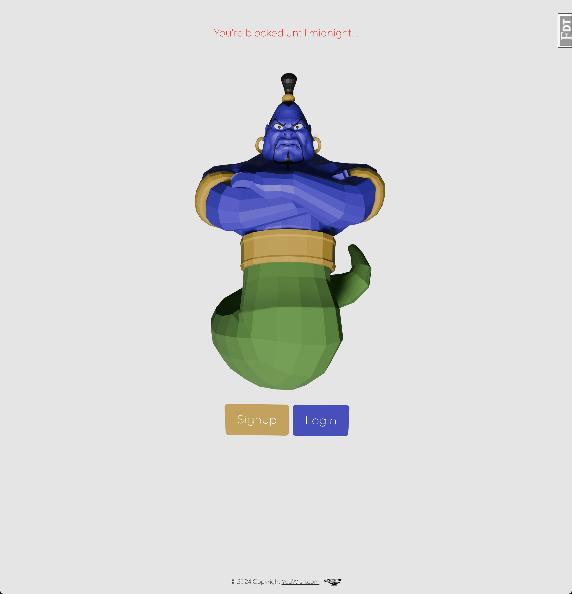

<!-- Improved compatibility of back to top link: See: https://github.com/othneildrew/Best-README-Template/pull/73 -->
<a name="readme-top"></a>


<!-- PROJECT LOGO -->
<br />
<div align="center">
  <a href="https://github.com/jazzcheema">
    
  </a>

<h3 align="center">YouWish</h3>

  <p align="center">
    Fullstack CRUD application where users can request three random videos between 200-1200 views. After third request, user is blocked at the database level until midnight (PST).
    <br />
    <a href="https://github.com/jazzcheema"><strong>Explore the docs »</strong></a>
    <br />
    <br />
    <a href="https://github.com/github_username/repo_name">View Demo</a>
  </p>
</div>


<!-- TABLE OF CONTENTS -->
<details>
  <summary>Table of Contents</summary>
  <ol>
    <li>
      <a href="#about-the-project">About The Project</a>
      <ul>
        <li><a href="#built-with">Built With</a></li>
      </ul>
    </li>
    <li>
      <a href="#getting-started">Getting Started</a>
      <ul>
        <li><a href="#prerequisites">Prerequisites</a></li>
        <li><a href="#installation">Installation</a></li>
      </ul>
    </li>
    <li><a href="#usage">Usage</a></li>
    <li><a href="#roadmap">Roadmap</a></li>
    <li><a href="#contributing">Contributing</a></li>
    <li><a href="#license">License</a></li>
    <li><a href="#contact">Contact</a></li>
    <li><a href="#acknowledgments">Acknowledgments</a></li>
  </ol>
</details>


<!-- ABOUT THE PROJECT -->
## About The Project


*This was my first fullstack application I built solo-- in collaboration with an artist (Kevin Netteberg) who designed all of the image assets. I learned a great deal about user interaction/experience, layers upon layers of event handlers, DOM manipulation, working with Cron, and responsiveness. This app was built before I understood or considered responsiveness. It has now been adjusted to work on most viewports, but there are still a few issues with viewport sizing-- mainly the video content display on wish page. Going forward I learned the importance of grid/columns/appropriate containers etc. to consider when building an application-- to be fair, I will probably never build another application again using vanilla JavaScript + Flask, so the experience was invaluable.*

*I wanted to block users at the database level to take authorization and security more seriously, rather than simple session based blocking-- where a user could simply restart the session and request more videos-- therefore, I block them at database and clear them at Midnight va Cron. My last serious implementation was a feature where the user clicks the Genie's face at the final page, and the browser prompts for permission to enable webcam-- here the user is able to view themselves, a sort of mirror of shame. I wanted to allow them to capture the image and save it as their profile image-- but i've moved onto other applications and ideas now!*

*I created all of the sounds and music for the application. Landing page has music, as well as final Genie page. Almost all buttons have a unique sound, and the lamp when clicked signals a success or ominous sound depending on the event. The homepage music was influenced by a sort of Playsation 1 'Crash Bandicoot' vibe-- I wanted the application to be playful. The final page music when the Genie appears is a bit spooky and threatening-- I really like exploring the interplay between these two worlds.*

I have included a playlist of all the music & sounds found on the application below!

<iframe width="100%" height="300" scrolling="no" frameborder="no" allow="autoplay" src="https://w.soundcloud.com/player/?url=https%3A//api.soundcloud.com/playlists/1831611720&color=%23ff5500&auto_play=true&hide_related=false&show_comments=true&show_user=true&show_reposts=false&show_teaser=true&visual=true"></iframe>

<div style="font-size: 10px; color: #cccccc;line-break: anywhere;word-break: normal;overflow: hidden;white-space: nowrap;text-overflow: ellipsis; font-family: Interstate,Lucida Grande,Lucida Sans Unicode,Lucida Sans,Garuda,Verdana,Tahoma,sans-serif;font-weight: 100;">
  <a href="https://soundcloud.com/thecyberfoolz" title="Thecyberfoolz" target="_blank" style="color: #cccccc; text-decoration: none;">Thecyberfoolz</a> · 
  <a href="https://soundcloud.com/thecyberfoolz/sets/youwish" title="YouWish" target="_blank" style="color: #cccccc; text-decoration: none;">YouWish</a>
</div>


<p align="right">(<a href="#readme-top">back to top</a>)</p>


### Built With


* [![JQuery][JQuery.com]][JQuery-url]
* ![Flask][Flask-logo]
* [![JavaScript][JavaScript-logo]][JavaScript-url]

<p align="right">(<a href="#readme-top">back to top</a>)</p>


<!-- GETTING STARTED -->
## Getting Started

Follow the steps below to set this project up on your local machine. Note: this project does have a cronjob running, so if you get blocked, make another user. Go to google cloud console and create a Youtube API key for free. You'll need one-- if you try for more, they may threaten to close your account for circumventing their policy w/ multiple developer keys.


### Installation


1. Clone the repo
   ```sh
   git clone https://github.com/jazzcheema/youwish
   ```
3. Set up a Virtual Environment
   ```sh
   python3 -m venv venv
   source venv/bin/activate
   ```
4. Install dependencies
   ```sh
   pip install -r requirements.txt
   ```
5. Set up the database
   ```sh
   createdb genie
   ```
6. Set up env variables
   ```sh
   YOUTUBE_API=...
   YOUTUBE_API_2=...
   MAIL_PASSWORD_GMAIL=...
   SECRET_KEY=...
   DATABASE_URL=postgresql:///genie
   ```
7. Run it
   ```sh
   flask run -p 5001
   ```

<p align="right">(<a href="#readme-top">back to top</a>)</p>


<!-- USAGE EXAMPLES -->
## Usage


*Users can sign into the application, or click the Genie face for a hidden sound. The Genie's face also follows your mouse movement on this page. Note: all visual elements are reactive to mousemovement.*
<br/>
<br/>

*User signup page. Can select between three profile images from the dropdown: Cobra, Monkey, Falcon. These images represent the 'mythical' forms a genie can take. Carpet also follows mousemovement.*
<br/>
<br/>

*Forgot password page that can be accessed from the login page. Secure password retrieval -> sends a link to your email on file -> takes you to a page to create new password.*
<br/>
<br/>

*Wish page where a user can click the lamp to request a video between 200-1200 views. Bottom of the page displays the top 3 users in the database who have been blocked.*
<br/>
<br/>

*After clicking on a video, this is what is displayed. Here a user can favorite a video and add it to their favorites collection, and also displays the views of the randomly selected video.*
<br/>
<br/>

*After third and final video request, the top 'locked' button now flashes and transforms to a button 'visit genie' that is clickable. If user does not click the button, they will be redirected in 15 seconds-- a sound also prompts the user here.*
<br/>
<br/>

*Final genie page that appears after you've been blocked from the app. User can click on the Genie face to activate local computer's webcam and display their own face. A button appears after a few seconds that takes the user to the initial landing page. Now they are blocked for 24 hours.*
<br/>
<br/>

*User can edit their profile here. Change username/ name/ last name/ and profile image. Need to confirm changes with password.*
<br/>
<br/>

*User can view their favorited videos here.*
<br/>
<br/>

*Once blocked, this message will appear, and user does not have access to signup, or login until Midnight (PST).*
<br/>
<br/>

<p align="right">(<a href="#readme-top">back to top</a>)</p>


<!-- ROADMAP -->
## Roadmap

- [ ] Feature 1
- [ ] Feature 2
- [ ] Feature 3
    - [ ] Nested Feature

See the [open issues](https://github.com/github_username/repo_name/issues) for a full list of proposed features (and known issues).

<p align="right">(<a href="#readme-top">back to top</a>)</p>


## License

Distributed under the MIT License. See `LICENSE.txt` for more information.

<p align="right">(<a href="#readme-top">back to top</a>)</p>


<!-- CONTACT -->
## Contact


Project Link: [https://github.com/jazzcheema/youwish](https://github.com/jazzcheema/youwish)

<p align="right">(<a href="#readme-top">back to top</a>)</p>


<!-- ACKNOWLEDGMENTS -->
## Acknowledgments

* Made in collaboration with Kevin Netteberg. Designed all image assets.


<p align="right">(<a href="#readme-top">back to top</a>)</p>


<!-- MARKDOWN LINKS & IMAGES -->
<!-- https://www.markdownguide.org/basic-syntax/#reference-style-links -->
[contributors-shield]: https://img.shields.io/github/contributors/github_username/repo_name.svg?style=for-the-badge
[contributors-url]: https://github.com/github_username/repo_name/graphs/contributors
[forks-shield]: https://img.shields.io/github/forks/github_username/repo_name.svg?style=for-the-badge
[forks-url]: https://github.com/github_username/repo_name/network/members
[stars-shield]: https://img.shields.io/github/stars/github_username/repo_name.svg?style=for-the-badge
[stars-url]: https://github.com/github_username/repo_name/stargazers
[issues-shield]: https://img.shields.io/github/issues/github_username/repo_name.svg?style=for-the-badge
[issues-url]: https://github.com/github_username/repo_name/issues
[license-shield]: https://img.shields.io/github/license/github_username/repo_name.svg?style=for-the-badge
[license-url]: https://github.com/github_username/repo_name/blob/master/LICENSE.txt
[linkedin-shield]: https://img.shields.io/badge/-LinkedIn-black.svg?style=for-the-badge&logo=linkedin&colorB=555
[linkedin-url]: https://linkedin.com/in/linkedin_username
[product-screenshot]: images/screenshot.png
[Next.js]: https://img.shields.io/badge/next.js-000000?style=for-the-badge&logo=nextdotjs&logoColor=white
[Next-url]: https://nextjs.org/
[React.js]: https://img.shields.io/badge/React-20232A?style=for-the-badge&logo=react&logoColor=61DAFB
[React-url]: https://reactjs.org/
[Vue.js]: https://img.shields.io/badge/Vue.js-35495E?style=for-the-badge&logo=vuedotjs&logoColor=4FC08D
[Vue-url]: https://vuejs.org/
[Angular.io]: https://img.shields.io/badge/Angular-DD0031?style=for-the-badge&logo=angular&logoColor=white
[Angular-url]: https://angular.io/
[Svelte.dev]: https://img.shields.io/badge/Svelte-4A4A55?style=for-the-badge&logo=svelte&logoColor=FF3E00
[Svelte-url]: https://svelte.dev/
[Laravel.com]: https://img.shields.io/badge/Laravel-FF2D20?style=for-the-badge&logo=laravel&logoColor=white
[Laravel-url]: https://laravel.com
[Bootstrap.com]: https://img.shields.io/badge/Bootstrap-563D7C?style=for-the-badge&logo=bootstrap&logoColor=white
[Bootstrap-url]: https://getbootstrap.com
[JQuery.com]: https://img.shields.io/badge/jQuery-0769AD?style=for-the-badge&logo=jquery&logoColor=white
[JQuery-url]: https://jquery.com
[Flask-logo]: https://img.shields.io/badge/Flask-000000?style=for-the-badge&logo=flask&logoColor=white
[Flask-url]: https://flask.palletsprojects.com/
[JavaScript-logo]: https://img.shields.io/badge/JavaScript-000000?style=for-the-badge&logo=javascript&logoColor=yellow
[JavaScript-url]: https://developer.mozilla.org/en-US/docs/Web/JavaScript
